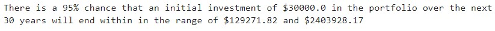

# APIs Homework: Financial Planning
This prototype application consists of two financial analysis notebook tools that helps credit union members enhance their financial health. The first tool is a personal finance planner that allows users to visualize their savings to determine if they have sufficient money saved for an emergency fund. The second tool is a retirement planning tool that uses the Alpaca API and Monte Carlo simulations to calculate expected portfolio returns for a specific initial investment amount.

## Technologies
The technologies required to use this project include: python 3.7 and pandas with the numpy, load_dotenv and alpaca_trade_api (for Alpaca API), MCSimulation (for Monte Carlo simulations), and os, requests and json libraries. As well as the %matplotlib function.

## Examples
The personal finance planner tool uses the 'Alternative Free Crypto API' to obtain Bitcoin and Ethereum prices. Then, the portfolio value of the cryptocurrencies is computed and printed to the screen. This tool also uses the 'Alpaca Markets API' to obtain stock close prices and stores them in a DataFrame. Next, it computes the value in dollars of the shares amount, and prints it to the screen. Lastly, a 'savings' DataFrame is created containing the total value (amount) of crypto assets and total value of shares. A pie chart of the 'savings' composition is plotted. 

The total savings amount is computed and users are informed of their progress in reaching the emergency fund goal.

The retirement planning tool uses the 'Alpaca Markets API' to retrieve historical stocks and bonds information. Then, the MCForecastTools toolkit is used to run Monte Carlo simulations for a 30 years portfolio performance projection. Next, the simulation results and probability/confidence intervals are plotted.

 Lastly, a retirement analysis is performed and the user is informed of their expected portfolio return at 95% lower and upper confidence intervals based on a $20,000 initial investment and a 50% increase in the initial investment.
 

